### Escuela Colombiana de Ingeniería

### Arquitecturas de Software - ARSW

---

### Integrantes

- Sergio Andrés Bejarano Rodríguez
- Laura Daniela Rodríguez Sánchez

---

## Escalamiento en Azure con Maquinas Virtuales, Sacale Sets y Service Plans

### Dependencias

- Cree una cuenta gratuita dentro de Azure. Para hacerlo puede guiarse de esta [documentación](https://azure.microsoft.com/es-es/free/students/). Al hacerlo usted contará con $100 USD para gastar durante 12 meses.
  Antes de iniciar con el laboratorio, revise la siguiente documentación sobre las [Azure Functions](https://www.c-sharpcorner.com/article/an-overview-of-azure-functions/)

### Parte 0 - Entendiendo el escenario de calidad

Adjunto a este laboratorio usted podrá encontrar una aplicación totalmente desarrollada que tiene como objetivo calcular el enésimo valor de la secuencia de Fibonnaci.

**Escalabilidad**
Cuando un conjunto de usuarios consulta un enésimo número (superior a 1000000) de la secuencia de Fibonacci de forma concurrente y el sistema se encuentra bajo condiciones normales de operación, todas las peticiones deben ser respondidas y el consumo de CPU del sistema no puede superar el 70%.

### Escalabilidad Serverless (Functions)

1. Cree una Function App tal cual como se muestra en las imagenes.


Creamos el recurso desde nuestra cuenta:

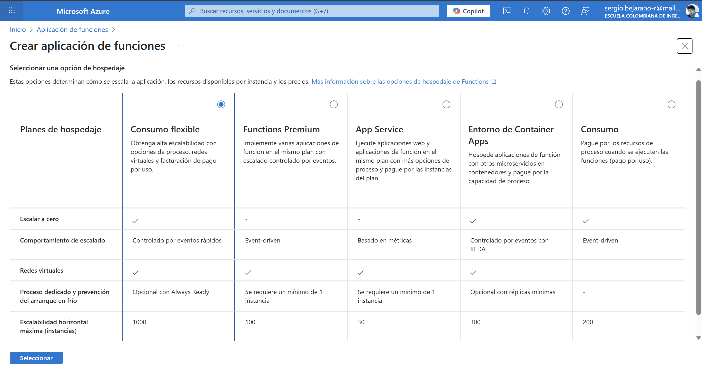


2. Instale la extensión de **Azure Functions** para Visual Studio Code.


3. Despliegue la Function de Fibonacci a Azure usando Visual Studio Code. La primera vez que lo haga se le va a pedir autenticarse, siga las instrucciones.


Luego de la autenticación, vemos que ya se cargan los recursos:
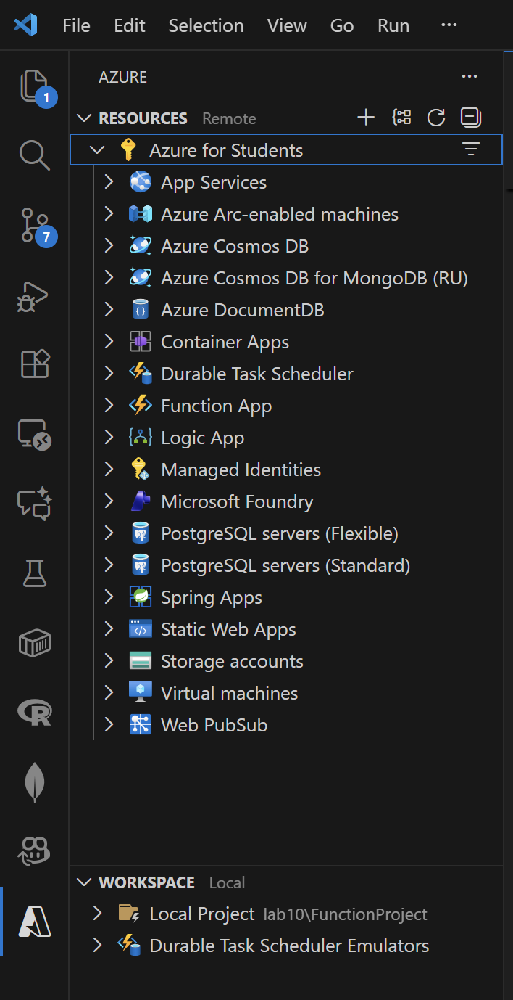

Para el despliegue, escogemos la opción respectiva:

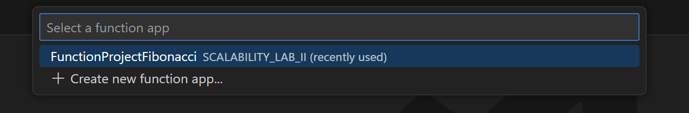

Y al desplegar, ya se actualiza en Azure:

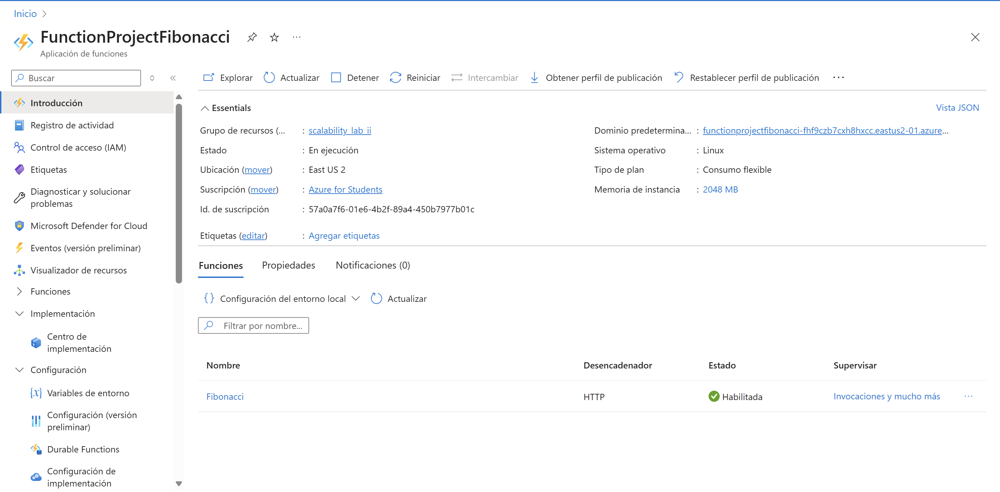

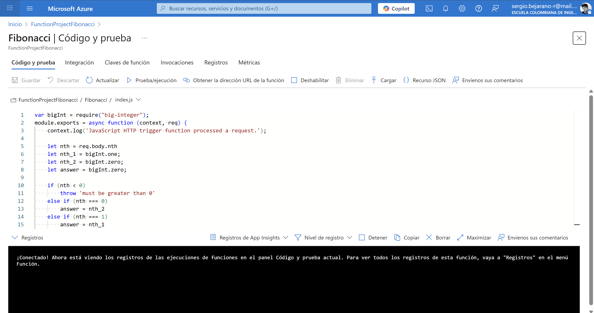

4. Dirijase al portal de Azure y pruebe la function.


Probando la función:
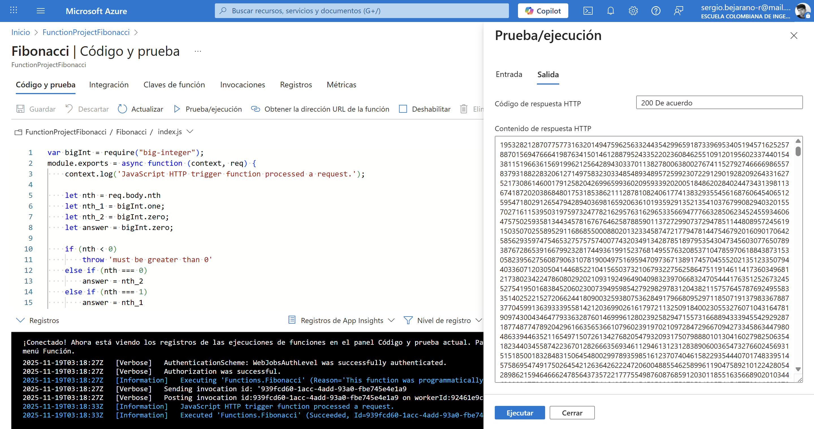

5. Modifique la colección de POSTMAN con NEWMAN de tal forma que pueda enviar 10 peticiones concurrentes. Verifique los resultados y presente un informe.

Creamos en postman la colección y realizamos una petición.


Exportamos la colección y guardamos el archivo generado en la carpeta `Postman`.
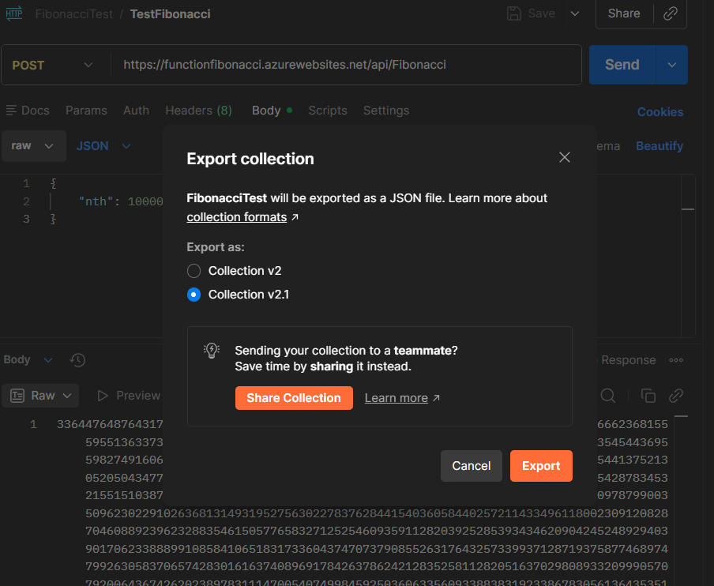

Ejecutamos.
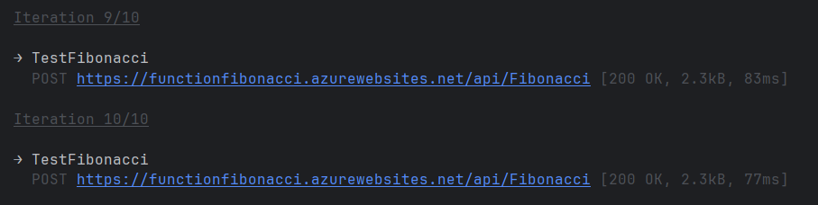

Obtenemos los siguientes resultados.
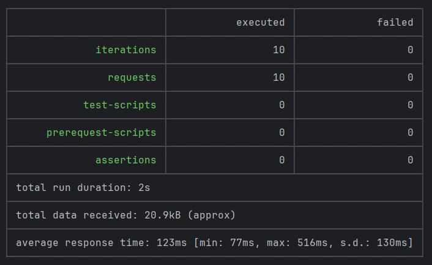

6. Cree una nueva Function que resuelva el problema de Fibonacci pero esta vez utilice un enfoque recursivo con memoization. Pruebe la función varias veces, después no haga nada por al menos 5 minutos. Pruebe la función de nuevo con los valores anteriores. ¿Cuál es el comportamiento?.

Creamos la carpeta `FibonacciMemo`, y en `index.js` implementamos la lógica para hacer Fibonacci recursivo.
````javascript
var bigInt = require("big-integer");

module.exports = async function (context, req) {
    context.log('FibonacciMemo function processed a request.');

    const nth = parseInt(req.body?.nth || req.query?.nth);
    if (isNaN(nth) || nth < 0) {
        context.res = {
            status: 400,
            body: "Please pass a valid non-negative integer 'nth' in the query or body"
        };
        return;
    }

    const memo = {
        0: bigInt.zero,
        1: bigInt.one
    };

    function fib(n) {
        if (memo[n] !== undefined) return memo[n];

        memo[n] = fib(n - 1).add(fib(n - 2));
        return memo[n];
    }

    const result = fib(nth);

    context.res = {
        status: 200,
        body: {
            nth: nth,
            fibonacci: result.toString()
        }
    };
};
````

Realizamos el despliegue nuevamente y en Azure observamos.

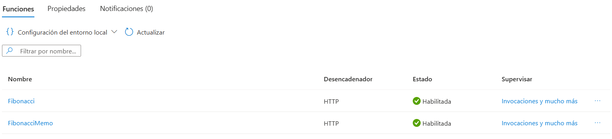

Realizamos una prueba y verificamos su correcto funcionamiento.

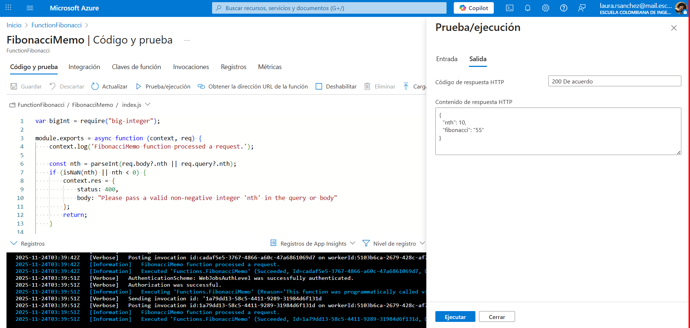

Después de invocar la función varias veces de forma consecutiva, los tiempos de respuesta se mantuvieron bajos. Esto ocurre porque la aplicación permanece activa en memoria y los contenedores ya están inicializados, lo que se conoce como warm start.

Sin embargo, al dejar de usar la función durante 5 minutos y volver a invocarla, el tiempo de ejecución aumentó de manera considerable. Este comportamiento corresponde a un cold start, que sucede cuando Azure descarga la instancia por inactividad para optimizar recursos.

**Preguntas**

- ¿Qué es un Azure Function?

Un Azure Function es un servicio de computación sin servidor (serverless) de Microsoft Azure que permite ejecutar pequeñas piezas de código o "funciones" en respuesta a eventos, sin necesidad de administrar infraestructura. Es ideal para ejecutar tareas específicas como:

➤ Procesar archivos cuando se suben a un almacenamiento

➤ Responder a solicitudes HTTP (crear APIs)

➤ Ejecutar tareas programadas (cron jobs)

➤ Procesar mensajes de colas

➤ Reaccionar a eventos de bases de datos

- ¿Qué es serverless?

Serverless (sin servidor) es un modelo de computación en la nube donde:

• No se administran servidores: Aunque físicamente existen servidores, el usuario no los gestiona, configura ni escala manualmente

• Pago por uso: Solo se paga por el tiempo de ejecución real del código (por milisegundos), no por capacidad reservada

• Escalado automático: El servicio escala automáticamente según la demanda, desde cero hasta miles de instancias

• Enfoque en código: El desarrollador se concentra únicamente en la lógica de negocio, no en la infraestructura

Es importante aclarar que "serverless" no significa que no haya servidores, sino que la responsabilidad de administrarlos está completamente abstraída del desarrollador.

- ¿Qué es el runtime y que implica seleccionarlo al momento de crear el Function App?

El runtime es el entorno de ejecución en el que correrá el código. Al crear un Function App, debe seleccionarse.

Implicaciones de seleccionar el runtime:

1. Lenguaje de programación: Define qué lenguaje se usará para escribir las funciones
2. Versión específica: Cada runtime tiene versiones (ej: Node.js 18, Python 3.11), lo que determina las características y bibliotecas disponibles
3. Rendimiento: Diferentes runtimes tienen distintas características de inicio en frío y rendimiento.
4. No es modificable después: Una vez creado el Function App con un runtime, no puede cambiarse; sería necesario crear uno nuevo
5. Compatibilidad de dependencias: Determina qué paquetes y librerías podrán usarse en el código.

- ¿Por qué es necesario crear un Storage Account de la mano de un Function App?

El Storage Account es un recurso obligatorio para que una Function App pueda operar correctamente. Al crearse una Function App, Azure solicita asociar un Storage Account, ya que este cumple funciones esenciales dentro del entorno.

Implicaciones de crear un Storage Account junto al Function App:

1. Administración del runtime: El Storage Account almacena archivos internos que permiten al Function App iniciar y mantener su estado operativo, incluyendo metadatos del host. 
2. Soporte para triggers y bindings: Algunos tipos de desencadenadores dependen directamente del Storage Account (por ejemplo, Blob Trigger, Queue Trigger o Timer Trigger).
3. Coordinación de instancias: En planes como Consumption o Premium, Azure utiliza el Storage Account para coordinar el escalado automático y la administración de múltiples contenedores.
4. Persistencia de archivos: El Function App requiere un Azure Files dentro del Storage Account para manejar configuraciones internas y archivos de soporte.
5. Ejecución confiable: Sin un Storage Account, la Function App no podría inicializarse ni ejecutar sus funciones de forma estable.

- ¿Cuáles son los tipos de planes para un Function App?, ¿En qué se diferencias?, mencione ventajas y desventajas de cada uno de ellos.

Azure Functions ofrece diferentes planes de hospedaje, y la elección del plan determina el modo en que las funciones se ejecutan, escalan y se facturan.

Implicaciones de los tipos de planes:

1. Consumption Plan

Es el modelo completamente serverless, en el que se paga únicamente por la ejecución.

*Ventajas:*

  - Pago por uso real, ideal para cargas variables.
  - Escalado automático según la demanda.
  - Bajo costo para aplicaciones con poca actividad.

*Desventajas:*

  - Presenta cold start al permanecer inactiva.
  - Tiempo de ejecución limitado.
  - No ofrece integración total con redes virtuales.

2. Premium Plan

Este plan combina el modelo serverless con instancias precalentadas.

*Ventajas:*

  - Elimina el cold start gracias a instancias siempre activas.
  - Tiempo de ejecución ilimitado.
  - Soporte para VNET, mayor aislamiento y configuraciones avanzadas.

*Desventajas:*

  - Costo mayor, ya que se pagan las instancias mínimas asignadas.
  - Requiere configuración más detallada del escalado.

3. Dedicated (App Service Plan)

Permite ejecutar funciones en un App Service Plan tradicional.

*Ventajas:*

  - No tiene límite de ejecución.
  - Adecuado si ya existe un App Service Plan disponible.
  - Control completo de la infraestructura.

*Desventajas:*
  - Costos fijos, incluso sin actividad.
  - El escalado no es tan inmediato como en los planes serverless.


- ¿Por qué la memoization falla o no funciona de forma correcta?

La memorización consiste en almacenar resultados en memoria para acelerar futuras ejecuciones. Sin embargo, en Azure Functions su efectividad es limitada debido a la naturaleza del entorno.

Implicaciones del funcionamiento de la memoization:
1. Instancias efímeras: Las funciones pueden ejecutarse en distintas máquinas, por lo que la memoria no es compartida entre instancias.
2. Escalado horizontal: Cuando Azure crea nuevas instancias para soportar carga, cada una mantiene su propio estado, lo que rompe el cache.
3. Cold start: Si una instancia es eliminada por inactividad, toda la información almacenada se pierde.
4. Ambiente sin estado: Azure Functions está diseñado como un entorno stateless, por lo que la memoria local no es confiable.
5. Dependencia del plan: En planes serverless como Consumption, la vida de las instancias es corta e impredecible.

- ¿Cómo funciona el sistema de facturación de las Function App?

El sistema de facturación depende directamente del plan elegido para el Function App, ya que cada modelo tiene un esquema diferente.

Implicaciones del sistema de facturación:

1. Consumption Plan

- Se cobra por número de ejecuciones y por tiempo consumido (GB-segundos).
- Incluye una capa gratuita de 1 millón de ejecuciones mensuales.
- Ideal para cargas eventuales o impredecibles.

2. Premium Plan

- Se factura según la cantidad y tamaño de las instancias siempre activas.
- También se cobra por ejecuciones adicionales.
- No existe capa gratuita.
- Pensado para escenarios de alto rendimiento y disponibilidad constante.

3. Dedicated (App Service Plan)

- El costo proviene del App Service Plan asignado, no del Function App en sí.
- Las funciones pueden ejecutarse indefinidamente sin costos extra por ejecución.
- Adecuado para empresas que ya pagan por infraestructura fija.